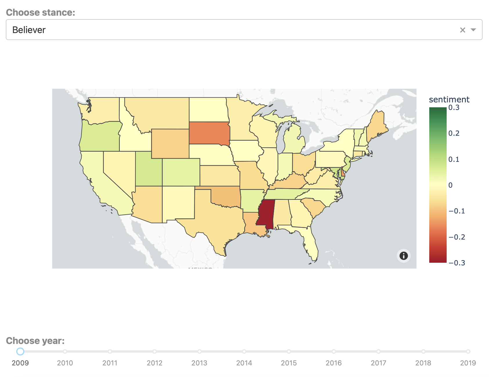

# Hot or Not: 
## Climate Change Anlaysis on Twitter Data with Disaster Events

## Description
Even though the more extreme weather events have been happening more frequently globally, there is still a portion of the population who are unaware that their lives are being impacted by climate change or are ignorant of the magnitude and reality of the issue. Thus, we analyze climate change patterns to determine people's sentiments and understanding of climate change. We correlate people's awareness with the intensity of weather diaster's impact in their area of residence. The data set we plan to use is a twitter collections dataset regarding climate change and human opinions. We also find additional third party API on extreme weather events to merge with the twitter data. 

For the result, we plan to provide three interaction plots in dashboard. We will visualize the average sentiment across the United States from 2009 to 2019 using the Twitter collections dataset. We will also create a word cloud for the most frequent words used in tweets related to climate change in 2009 compared to 2019. Lastly, we plan to conduct regression analysis on sentiment change using an indicator of weather data happened before or after the user's tweet. We will merge third-party API data from FEMA (Federal Emergency Management Agency) on extreme weather events with the Twitter collections dataset to understand the correlation between climate change's impact in an area and people's sentiment towards the issue. We also inlcude two jupyter notebooks to provide some of the exploratory and statistical analysis. This multi-faceted analysis will help us gain a comprehensive understanding of people's sentiments and awareness towards climate change, which can help inform effective climate change communication strategies.

## Built with
- Python
- Plotly/Seaborn
- Dash
- Scikitlearn
- Statsmodels

## Data sources
1. Climate Change Twitter Dataset: https://doi.org/10.1016/j.eswa.2022.117541 
2. Federal Emergency Management Agency Disaster Events Data (API): https://www.fema.gov/openfema-data-page/disaster-declarations-summaries-v2
3. Twitter Developer Platform (API): https://developer.twitter.com/en/portal/dashboard

## Getting Started
To get started with the Dashboard, follow these steps:

1. Clone the repository: git clone https://github.com/uchicago-capp122-spring23/30122-project-hot-or-not.git
2. Run  *poetry install* to install the necessary packages
3. Run  *poetry shell* to activate the virtual environment
4. Run  *python -m main* to open the dashboard

To check out EDA and data analysis:
1. To view the EDA notebook, click [here](https://github.com/uchicago-capp122-spring23/30122-project-hot-or-not/blob/main/main/analysis/EDA.ipynb).
2. To view the analysis notebook, click [here](https://github.com/uchicago-capp122-spring23/30122-project-hot-or-not/blob/main/main/analysis/analysis.ipynb). (The visualization in this file is also included in the dashboard)

Other notes:
- Due to the constraint of file size, to access the large dataset when running data_clean.py, click the following google drive to download the twitter dataset:
https://drive.google.com/drive/folders/1PU5ILt9Db1qrmUOgH_0lbAzGOOQovBca?usp=sharing
. Move the generated file called "twitter.csv" into the subdirectory called "sources". You would be able to run the “data_clean.py” in the "cleaning" directory. Simiarly, to operate the "tweet_hydration_and_cleaning.py", you also need to download the "hydrated_tweets.json" and move to the corresponding directory.
- The sentiment map in the dash takes time to load due to large data size. 

## Directory on important files
- main
  - analysis
    - analysis.ipynb
    - EDA.ipynb
  - cleaning
    - data_clean.py
    - tweet_hydration_and_cleaning.py
  - cloud
    - common_words.py
    - word_cloud_generator.py
  - images
  - sources
  - src
    - app.py
    - utils.py  
   
## Demo on Visualization
### Word Cloud

### Interactive Sentiment Map

## Authors
Jonathan Juarez

Ridhi Purohit

Jaskirat Kaur

Grey Xu

